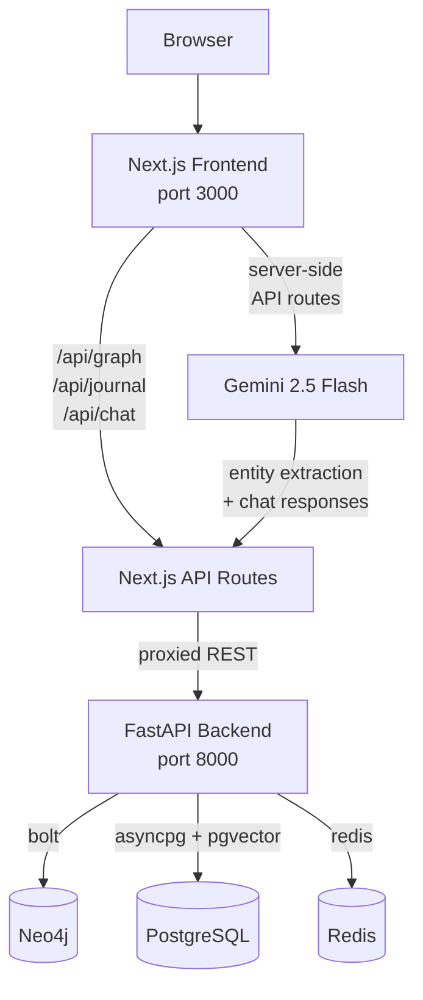

# BrainClone

Bring your memories back to life. Transform journal entries, photos, and documents into an AI-powered 3D knowledge graph of people, places, and moments — then explore and query them conversationally.


## Features

- **3D Knowledge Graph** — Interactive WebGL visualization using `react-force-graph-3d` with Three.js bloom post-processing, node hover/selection highlighting, and an animated "Neural Journey" fly-through.
- **AI Journaling** — Write memories in natural language; Gemini 2.5 Flash extracts people, places, events, emotions, and relationships and adds them to the graph in real time.
- **Context-Aware Chat** — Ask questions about your memories; Gemini responds with full knowledge-graph context.
- **Cross-Device Persistence** — Graph state is persisted to `localStorage` (via Zustand) and synced to the backend for cross-device access.
- **Neo4j Graph Backend** — Full Cypher query support; the frontend's server-side API route proxies queries and transforms results into the `{ nodes, links }` shape the graph component expects.

## Tech Stack

| Layer | Technologies |
|---|---|
| **Frontend** | Next.js 15 (App Router), React 19, TypeScript, Tailwind CSS 3, `react-force-graph-3d`, Three.js, Zustand, Axios, Zod, Lucide icons |
| **AI** | Google Gemini 2.5 Flash (`@google/generative-ai`) — called from Next.js API routes (server-side) |
| **Backend API** | FastAPI (Python 3.13), Uvicorn, structlog, Pydantic Settings |
| **Graph DB** | Neo4j 5.x (Aura cloud or self-hosted) via the official `neo4j` Python driver |
| **Vector DB** | PostgreSQL 16 + pgvector (via `asyncpg`) — embeddings & similarity search |
| **Caching** | Redis (optional) |
| **Package Mgmt** | npm workspaces (root), pnpm (frontend), uv / pip (backend) |

## Architecture



### Request Flow

1. The browser loads the Next.js SPA on port `3000`.
2. Graph data is fetched via `GET /api/graph` — a **Next.js server-side API route** that proxies a Cypher query (`POST /api/v1/graph/cypher`) to the FastAPI backend, transforms the raw Neo4j records into `{ nodes, links }`, and returns them. This avoids CORS and keeps the backend URL server-side.
3. **Journaling**: the user writes a memory → `POST /api/journal` → Next.js API route calls Gemini to extract entities → the frontend merges extracted nodes/links into the graph store.
4. **Chat**: the user asks a question → `POST /api/chat` → Next.js API route sends the question + graph context to Gemini → returns the AI response.
5. The FastAPI backend exposes graph CRUD, search, traversal, visualization, and raw Cypher endpoints under `/api/v1/graph/*` and `/api/v1/search/*`.

## Monorepo Layout

```
Brain-clone-divhacks/
├── frontend/                     Next.js app (TypeScript)
│   ├── app/
│   │   ├── page.tsx              Main page — splash screen, 3D graph, journaling, chat
│   │   ├── layout.tsx            Root layout (Geist font, metadata)
│   │   ├── globals.css           Tailwind + custom animations
│   │   └── api/
│   │       ├── graph/route.ts    Proxies Cypher queries to FastAPI, transforms results
│   │       ├── journal/route.ts  Calls Gemini for entity extraction
│   │       └── chat/route.ts     Calls Gemini for conversational responses
│   ├── components/
│   │   └── Graph3D.tsx           3D force-directed graph (Three.js, bloom, hover effects)
│   ├── lib/
│   │   ├── api.ts                Axios client + Zod schemas for backend API
│   │   └── gemini.ts             Gemini AI service (journal analysis, chat)
│   ├── stores/
│   │   └── graphStore.ts         Zustand store (persisted to localStorage + API sync)
│   └── types/
│       └── graph.ts              GraphNode, GraphLink, NodeType definitions
│
├── backend/                      FastAPI app (Python 3.13)
│   ├── src/
│   │   ├── main.py               App entrypoint, lifespan, CORS, routers
│   │   ├── config.py             Pydantic Settings (env-driven config)
│   │   ├── api/routes/
│   │   │   ├── graph.py          Entity CRUD, relationships, traversal, Cypher
│   │   │   ├── search.py         Document, semantic, hybrid, contextual search
│   │   │   └── documents.py      Document upload/processing (R2R — currently disabled)
│   │   ├── services/
│   │   │   ├── neo4j_service.py  Neo4j graph operations
│   │   │   ├── vector_service.py pgvector embedding operations
│   │   │   ├── r2r_service.py    R2R integration (currently disabled)
│   │   │   └── mock_data.py      Sample memory data for demo mode
│   │   ├── models/
│   │   │   ├── entities.py       Entity, Person, Event, Location models
│   │   │   └── relationships.py  Relationship, traversal, visualization models
│   │   └── database/
│   │       ├── neo4j.py          Neo4j connection manager
│   │       └── postgres.py       AsyncPG connection pool
│   ├── data/                     Sample graph data (JSON)
│   ├── seed_neo4j.py             Seed script for populating Neo4j
│   ├── populate_extended_neo4j.py Extended seed data
│   ├── Dockerfile                Lean production image (Python 3.13-slim)
│   ├── requirements.txt          Pip dependencies (for Render/lean deploys)
│   ├── pyproject.toml            Full project config (uv, ruff, black, mypy, pytest)
│   └── DEPLOY.md                 Google Cloud Run deployment guide
│
├── r2r-config/
│   └── config.yaml               R2R service config (Anthropic completion, OpenAI embeddings)
│
├── example/
│   ├── datasets/                 Sample graph datasets (JSON, CSV)
│   └── display/
│       └── index.html            Standalone graph visualization demo
│
├── docker-compose.production.yml Full-stack compose (Postgres, R2R, backend, nginx)
├── nginx.conf                    Reverse proxy config (rate limiting, CORS)
├── render.yaml                   Render Blueprint (backend only, Neo4j-only mode)
├── vercel.json                   Vercel config (frontend deployment)
├── deploy.sh                     Multi-platform deployment script
├── package.json                  npm workspaces root (delegates to frontend/)
└── .env.production.example       Template for production environment variables
```

## Current State

> **Demo / Neo4j-only mode.** The R2R document-processing pipeline and the `documents` API router are disabled in `main.py` for lean deployment. The backend starts a `MockDataService` to provide sample graph data when external databases are unreachable. Gemini-powered journaling and chat work independently via the frontend's Next.js API routes.

## Getting Started

### Prerequisites

- **Node.js** ≥ 18 and **pnpm** (frontend)
- **Python** 3.13+ (backend)
- **Neo4j** 5.x — [Neo4j Aura free tier](https://neo4j.com/cloud/aura-free/) works
- **Gemini API key** — [Google AI Studio](https://makersuite.google.com/app/apikey)

### 1. Clone & install

```bash
git clone https://github.com/BrainCloneTeam/Brain-clone-divhacks.git
cd Brain-clone-divhacks

# Frontend
cd frontend && pnpm install && cd ..

# Backend
cd backend
python -m venv venv
# Windows: venv\Scripts\activate | macOS/Linux: source venv/bin/activate
pip install -r requirements.txt
cd ..
```

### 2. Configure environment

```bash
# Frontend — Gemini key
echo 'NEXT_PUBLIC_GEMINI_API_KEY=your-key-here' > frontend/.env.local

# Backend — Neo4j credentials
cat > backend/.env <<EOF
NEO4J_URI=neo4j+s://your-instance.databases.neo4j.io
NEO4J_USER=neo4j
NEO4J_PASSWORD=your-password
NEO4J_DATABASE=neo4j
CORS_ORIGINS=http://localhost:3000
EOF
```

### 3. Run

```bash
# Terminal 1 — Backend
cd backend
uvicorn src.main:app --reload --port 8000

# Terminal 2 — Frontend
cd frontend
pnpm dev
```

Open [http://localhost:3000](http://localhost:3000) to see the 3D graph. Backend docs at [http://localhost:8000/docs](http://localhost:8000/docs).

## API Endpoints

### Backend (FastAPI — port 8000)

| Method | Path | Description |
|--------|------|-------------|
| `GET` | `/health` | Service health & status |
| `GET` | `/metrics` | Entity and embedding counts |
| `POST` | `/api/v1/graph/entities` | Create entity |
| `GET` | `/api/v1/graph/entities/{id}` | Get entity (optionally with relationships) |
| `PUT` | `/api/v1/graph/entities/{id}` | Update entity |
| `DELETE` | `/api/v1/graph/entities/{id}` | Delete entity and its relationships |
| `POST` | `/api/v1/graph/relationships` | Create relationship |
| `GET` | `/api/v1/graph/entities/{id}/relationships` | Get entity relationships |
| `POST` | `/api/v1/graph/search/entities` | Search entities with filters |
| `POST` | `/api/v1/graph/search/similar` | Embedding similarity search |
| `POST` | `/api/v1/graph/traverse` | Graph traversal from a starting node |
| `POST` | `/api/v1/graph/visualize` | Graph data for visualization |
| `POST` | `/api/v1/graph/cypher` | Execute raw Cypher query |
| `POST` | `/api/v1/search/hybrid` | Hybrid search across documents & graph |

### Frontend (Next.js API Routes — port 3000)

| Method | Path | Description |
|--------|------|-------------|
| `GET` | `/api/graph` | Proxy Cypher query to backend, transform into `{ nodes, links }` |
| `POST` | `/api/journal` | Analyze journal text via Gemini, extract entities |
| `POST` | `/api/chat` | Chat with Gemini using graph context |

## Deployment

| Component | Platform | Config File |
|-----------|----------|-------------|
| Frontend | **Vercel** | `vercel.json` |
| Backend | **Render** | `render.yaml` |
| Backend | **Google Cloud Run** | `backend/Dockerfile` + `backend/DEPLOY.md` |
| Backend | **Railway** | `backend/railway.json` |
| Backend | **Fly.io** | `backend/fly.toml` |
| Full stack | **Docker Compose** | `docker-compose.production.yml` |

See [`backend/DEPLOY.md`](backend/DEPLOY.md) for step-by-step Cloud Run instructions, and [`deploy.sh`](deploy.sh) for the multi-platform deployment script.

## Environment Variables

| Variable | Where | Description |
|----------|-------|-------------|
| `NEXT_PUBLIC_GEMINI_API_KEY` | Frontend `.env.local` | Google Gemini API key |
| `NEXT_PUBLIC_API_URL` | Frontend `.env.local` | Backend URL (default: `http://localhost:8000/api/v1`) |
| `NEO4J_URI` | Backend `.env` | Neo4j connection URI |
| `NEO4J_USER` | Backend `.env` | Neo4j username |
| `NEO4J_PASSWORD` | Backend `.env` | Neo4j password |
| `NEO4J_DATABASE` | Backend `.env` | Neo4j database name |
| `CORS_ORIGINS` | Backend `.env` | Comma-separated allowed origins |
| `POSTGRES_*` | Backend `.env` | PostgreSQL connection (for pgvector) |
| `REDIS_*` | Backend `.env` | Redis connection (optional) |

See [`.env.production.example`](.env.production.example) for the full list.

## License

[MIT](LICENSE) — © 2025 BrainCloneTeam
